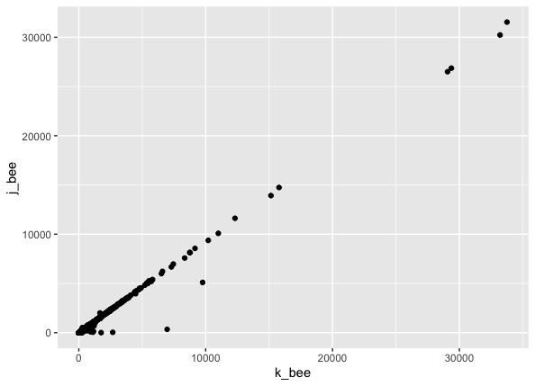

# 03a GSNAP

Compare Kathy and Jennifer's gsnap results

```
#! /usr/bin/env Rscript

library(tidyverse)
library(magrittr)

k_bee <- read_delim("bee.genecounts.out.txt", delim="\t")
j_bee <- readxl::read_excel("gsnap_counts.xlsx", sheet="gene")

names(j_bee)

k_sub <- k_bee %>%
  select(Geneid, "1-A02-A2_S8_L002_R1_001.fastq") %>%
  pivot_longer(., col="1-A02-A2_S8_L002_R1_001.fastq")

j_sub <- j_bee %>%
  select(Geneid, "1-A02-A2_S8") %>%
  pivot_longer(., col= "1-A02-A2_S8")

both <- rbind(k_sub, j_sub) %>%
  pivot_wider(., id_cols="Geneid")

names(both) <- c("Geneid", "k_bee", "j_bee")

both %>%
  ggplot(., aes(x=k_bee, y=j_bee)) +
  geom_point()
```

Pretty consistent... the genes off the diagnal are probably due to different parameters.


