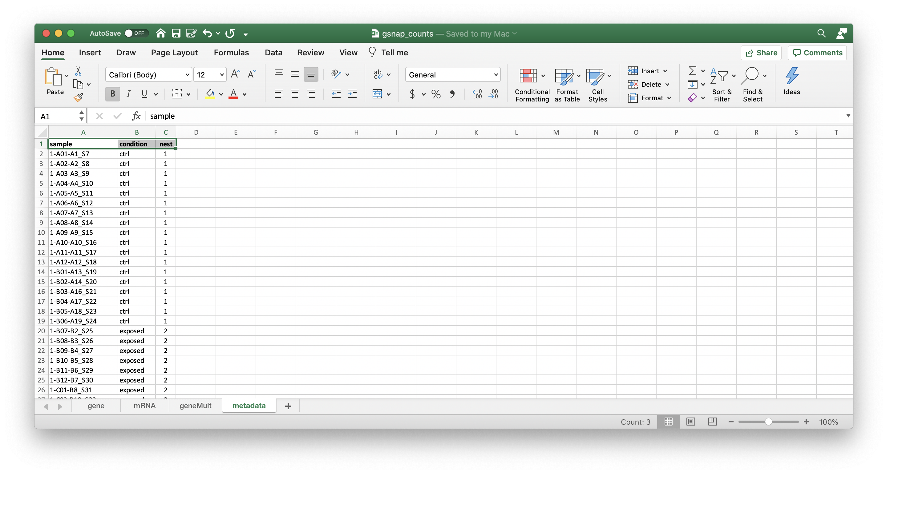

# 04 DESeq2

DESeq2 is expecting an input file of gene counts, similar to the following.

| Geneid | Control_rep1 | Control_rep2 | Treatment_rep1 | Treatment_rep2 |
| :--|:--|:--|:--|:--|
|gene1 | # | # | # | # |
|gene2 |  # | # | # | # |
|gene3 | # | # | # | # |
|gene4 |  # | # | # | # |

We can read in this as a textfile `gsnap_genecounts.txt` or from the combined excel file `gsnap_counts.xlsx` where we have added a metadata tab



(1) Load R libraries

```
library(DESeq2)
library(tidyverse)
library(magrittr)
```

(2) Load gene counts and metadata

```
data <- read_delim("bee_genecounts.txt", delim="\t")   # Text file
data <- read_excel
```

(3) Run DESeq2

```
de_input = as.matrix(data[,-1])
row.names(de_input) = data$Geneid

# (1) Create DESeq2 object
dds <- DESeqDataSetFromMatrix(de_input, colData=meta_df, design = ~condition)

# (2) Run DESeq
dds <- DESeq(dds)

# (3) Get table of results
res <- results(dds)
res <- res[order(res$padj), ]
resdata <- merge(as.data.frame(res), as.data.frame(counts(dds, normalized=TRUE)), by="row.names", sort=FALSE)
names(resdata)[1] <- "Gene"
write.csv(resdata, file="bee_DESeq2_results.csv", quote=FALSE, row.names=F)
```