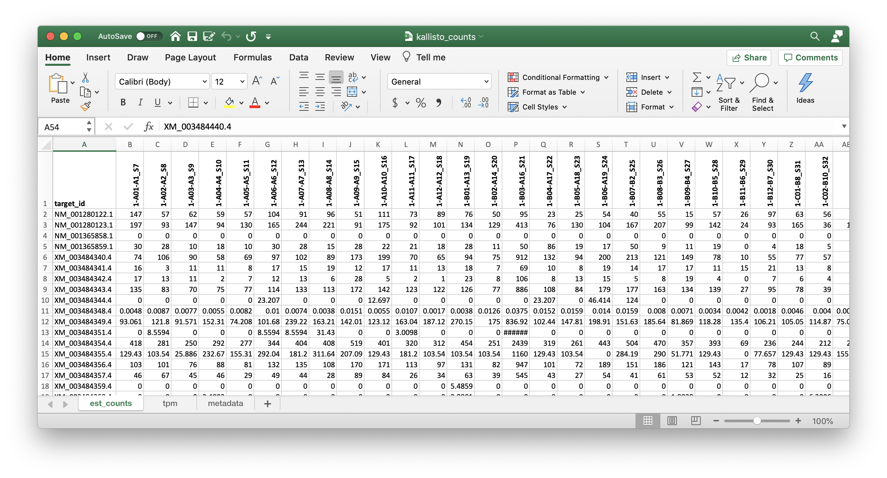

# 06 Kallisto

(1) Index reference transcriptome

```
module load kallisto

GENOME_CDNA=02_Genome/GCF_000188095.3_BIMP_2.2_rna.fna.gz
G_NAME=$(basename $GENOME_CDNA) |sed 's/.fna.gz//g'

kallisto index -i ${G_NAME}.idx ${GENOME_CDNA}
```

(2) Quantify gene counts

```
PROC=16

for READ in 00_Raw-Data/*.fastq.gz
do
  READNAME=$(basename ${FILE}) |sed 's/.fastq.gz//g'
  
  kallisto quant -i ${G_NAME}.idx -o ${READNAME}_quant -b 20 -t ${PROC} --single -l50 -s1 ${READ}
done
```

Counts are in `${READNAME}_quant/abundance.tsv`

```
target_id	length	eff_length	est_counts	tpm
NM_001280122.1	2346	2297	28	9.90628
NM_001280123.1	1285	1236	67	44.0524
NM_001365858.1	2120	2071	0	0
NM_001365859.1	2151	2102	7	2.70632
XM_003484340.4	711	662	151	185.367
XM_003484341.4	1236	1187	9	6.16177
...
```

(3) Combine the Kallisto counts (`est_counts` and `tsv`) into one file, by modifying the R script from GSNAP

```
#! /usr/bin/env Rscript

library(tidyverse)
library(magrittr)
library(readxl)

# === Get list of featureCount output files
(featureCount_files <- list.files(path = "03_Kallisto", pattern = "*_quant$", full.names = TRUE) %>% 
    paste(., "/abundance.tsv", sep=""))

# === Read in 1st file
data <- read_delim(featureCount_files[1], delim="\t", comment = "#" ) %>%
  select(target_id, est_counts, tpm) %>%             # est_counts or tpm
  pivot_longer(cols=c(est_counts, tpm)) %>% 
  mutate(
    sample=featureCount_files[1] %>% gsub("03_Kallisto/","",.) %>% gsub("_L002_R1_001_quant/abundance.tsv","", .)
  )

# === Loop and append the rest
for (count_file in featureCount_files[-1]){
  print(count_file)
  temp <- read_delim(count_file, delim="\t", comment = "#") %>%
    select(target_id, est_counts, tpm) %>%             # est_counts or tpm
    pivot_longer(cols=c(est_counts, tpm)) %>% 
    mutate(
      sample=count_file %>% gsub("03_Kallisto/","",.) %>% gsub("_L002_R1_001_quant/abundance.tsv","", .)
    )
  data = rbind(data, temp)
}

# === Convert to excel like data (wider)
data_est = subset(data, name=="est_counts")
data_tpm = subset(data, name=="tpm")

wide_est = data_est %>%
  pivot_wider(id_cols=target_id, names_from=sample, values_from=value )

wide_tpm = data_tpm %>%
  pivot_wider(id_cols=target_id, names_from=sample, values_from=value )
  

# === Save tab delimited file (smaller file size)
write_delim(wide_est, "kallisto_est_counts.txt", delim="\t")
write_delim(wide_tpm, "kallisto_tpm.txt", delim="\t")
```

Then combining `kallisto_est_counts.txt` and `kallisto_tpm.txt` in one `kallisto_counts.xlsx` with separate tabs.



View [kallisto_counts.xlsx](results/kallisto_counts.xlsx).


