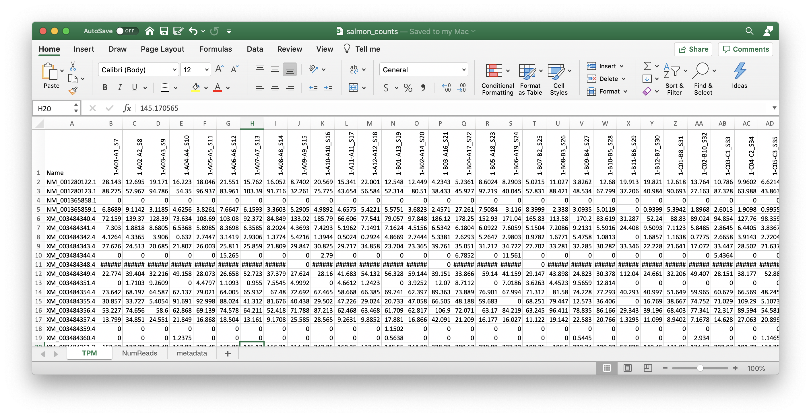

# 08 Salmon

(1) Index reference transcriptome

```
module load salmon

GENOME_CDNA=02_Genome/GCF_000188095.3_BIMP_2.2_rna.fna.gz
G_NAME=$(basename $GENOME_CDNA) |sed 's/.fna.gz//g'

salmon index -i ${G_NAME} -t ${GENOME}
```

(2) Quantify gene counts

```
PROC=16

for READ in 00_Raw-Data/*.fastq.gz
do
  READNAME=$(basename ${FILE}) |sed 's/.fastq.gz//g'

  salmon quant -l A -p ${PROC} --validateMappings -i ${G_NAME} -r ${READ} -o ${READNAME}_quant
done
```

The gene counts are in ``${READNAME}_quant/quant.sf`

```
Name	Length	EffectiveLength	TPM	NumReads
NM_001280122.1	2346	2097.000	28.143102	131.000
NM_001280123.1	1285	1036.000	88.274523	203.000
NM_001365858.1	2120	1871.000	0.000000	0.000
NM_001365859.1	2151	1902.000	6.868890	29.000
XM_003484340.4	711	462.000	72.158723	74.000
XM_003484341.4	1236	987.000	7.303011	16.000
XM_003484342.4	2105	1856.000	4.126388	17.000
...
```

(3) Run `multiqc`

```
cd 03_Salmon
multiqc .
mv multiqc_report.html salmon_multiqc_report.html
```

View [salmon_multiqc_report.html](results/salmon_multiqc_report.html)

(4) Combine counts information into one file, by modifying the script for GSNAP

```
#! /usr/bin/env Rscript

library(tidyverse)
library(magrittr)
library(readxl)

# === Get list of featureCount output files
(featureCount_files <- list.files(path = "03_Salmon", pattern = "*_quant$", full.names = TRUE) %>% 
    paste(., "/quant.sf", sep=""))

# === Read in 1st file
data <- read_delim(featureCount_files[1], delim="\t", comment = "#" ) %>%
  select(Name, TPM, NumReads) %>%             # est_counts or tpm
  pivot_longer(cols=c(TPM, NumReads)) %>% 
  mutate(
    sample=featureCount_files[1] %>% gsub("03_Salmon/","",.) %>% gsub("_L002_R1_001_quant/quant.sf","", .)
  )

# === Loop and append the rest
for (count_file in featureCount_files[-1]){
  print(count_file)
  temp <- read_delim(count_file, delim="\t", comment = "#") %>%
    select(Name, TPM, NumReads) %>%             # est_counts or tpm
    pivot_longer(cols=c(TPM, NumReads)) %>% 
    mutate(
      sample=count_file %>% gsub("03_Salmon/","",.) %>% gsub("_L002_R1_001_quant/quant.sf","", .)
    )
  data = rbind(data, temp)
}

# === Convert to excel like data (wider)
data_numreads = subset(data, name=="NumReads")
data_tpm = subset(data, name=="TPM")

wide_est = data_numreads %>%
  pivot_wider(id_cols=Name, names_from=sample, values_from=value )

wide_tpm = data_tpm %>%
  pivot_wider(id_cols=Name, names_from=sample, values_from=value )
  

# === Save tab delimited file (smaller file size)
write_delim(wide_est, "salmon_numreads.txt", delim="\t")
write_delim(wide_tpm, "salmon_tpm.txt", delim="\t")
```

Combine `salmon_numreads.txt` and `salmon_tpm.txt` into an excel file, on separate tabs.



View [salmon_counts.xlsx](results/salmon_counts.xlsx)
