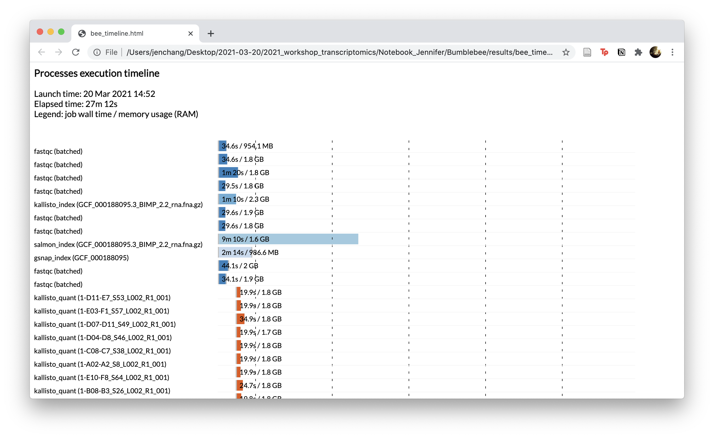

# 09 Nextflow

Wrapped [01_Quality-Control](01_Quality-Control), [03_GSNAP](03_GSNAP.md), [06_Kallisto](06_Kallisto.md), and [08_Salmon](08_Salmon.md) in a Nextflow script.

```
N E X T F L O W  ~  version 20.10.0
Launching `bee_run.nf` [zen_turing] - revision: a223d0bafa
executor >  slurm (372)
[db/e9b8ef] process > fastqc (batched)               [100%] 8 of 8 ✔
[54/1e3e96] process > multiqc                        [100%] 1 of 1 ✔
[31/417ccc] process > kallisto_index (GCF_0001880... [100%] 1 of 1 ✔
[ef/027b77] process > kallisto_quant (1-B07-B2_S2... [100%] 60 of 60 ✔
[4e/f77778] process > salmon_index (GCF_000188095... [100%] 1 of 1 ✔
[40/4d320a] process > salmon_quant (1-B03-A16_S21... [100%] 60 of 60 ✔
[b2/f72b29] process > gsnap_index (GCF_000188095)    [100%] 1 of 1 ✔
[97/425670] process > gsnap_quant (1-C10-C9_S40_L... [100%] 60 of 60 ✔
[60/aeae96] process > featureCounts_gene (1-C10-C... [100%] 60 of 60 ✔
[00/044404] process > featureCounts_mRNA (1-C10-C... [100%] 60 of 60 ✔
[41/b2c904] process > featureCounts_geneMult (1-C... [100%] 60 of 60 ✔
Completed at: 20-Mar-2021 15:19:42
Duration    : 27m 12s
CPU hours   : 11.8
Succeeded   : 372
```

Ran pretty quickly over a weekend on Atlas HPC, ~27 minutes.



View entire [bee_timeline.html](results/bee_timeline.html) and scroll down to see GSNAP and salmon run times. Kallisto was drastically faster than the other two.

To learn Nextflow, visit [https://www.nextflow.io/](https://www.nextflow.io/)
