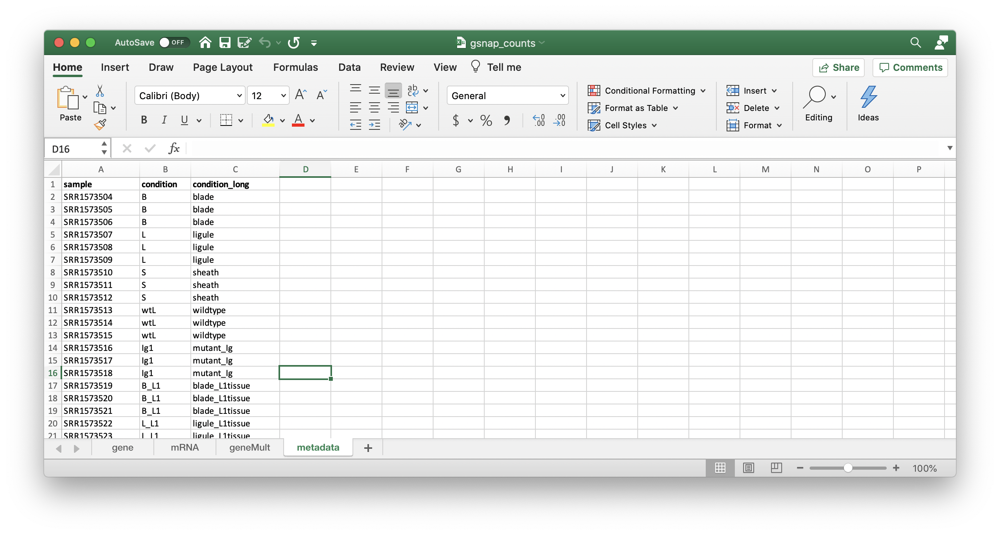
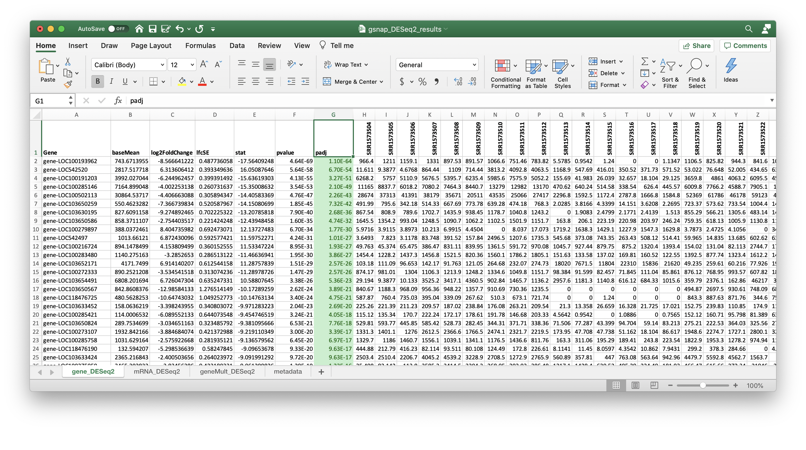
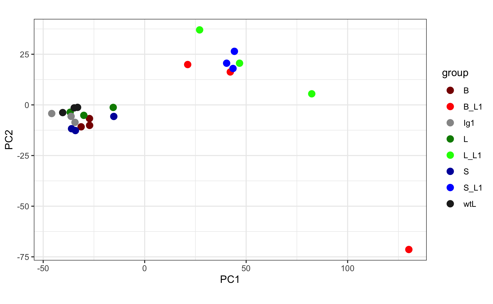
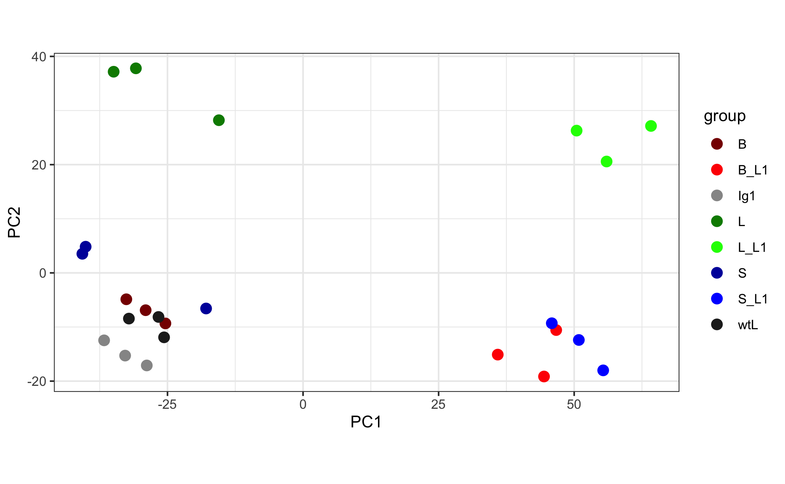
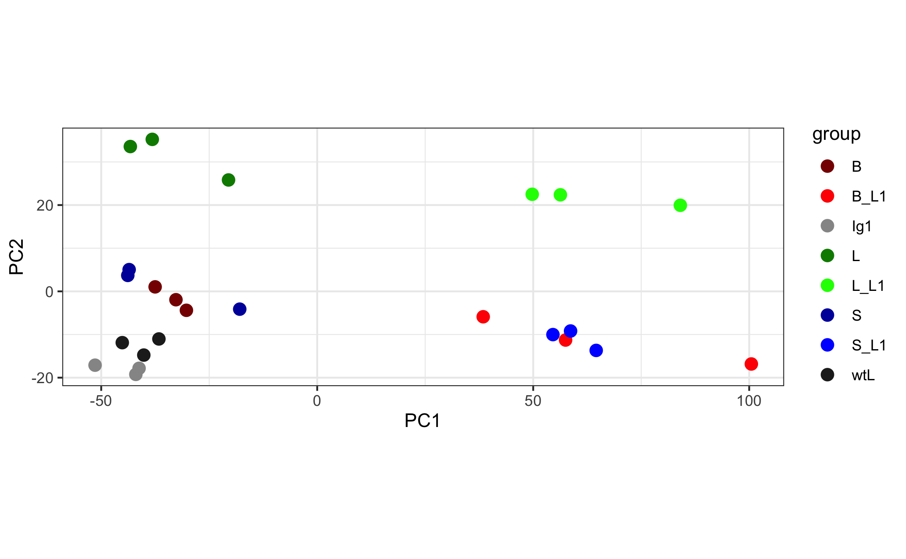

# 04 DESeq2

DESeq2 is expecting an input file of gene counts, similar to the following.

| Geneid | Control_rep1 | Control_rep2 | Treatment_rep1 | Treatment_rep2 |
| :--|:--|:--|:--|:--|
|gene1 | # | # | # | # |
|gene2 |  # | # | # | # |
|gene3 | # | # | # | # |
|gene4 |  # | # | # | # |

We can read in this as a textfile `gsnap_genecounts.txt` or from the combined excel file `gsnap_counts.xlsx` where we have added a metadata tab



(1) Load R libraries

```
#! /usr/bin/env Rscript
library(DESeq2)
library(tidyverse)
library(magrittr)
library(readxl)
```

(2) Load gene counts and metadata

```
data <- read_excel("gsnap_counts.xlsx", sheet="gene")  # gene/mRNA/geneMult   
de_input = as.matrix(data[,-1])
row.names(de_input) = data$Geneid

metadata <- read_excel("gsnap_counts.xlsx", sheet="metadata")
row.names(metadata)=metadata$sample
```

(3) Run DESeq2

```
# (1) Create DESeq2 object
dds <- DESeqDataSetFromMatrix(de_input, colData = metadata, design = ~condition)

# (2) Run DESeq2
dds <- DESeq(dds)

# (3) Pull out results
res <- results(dds)
table(res$padj<0.05)      # DEGs: 3164 genes, 2250 mRNAs, 3052 geneMult

# (4) Save to file
res <- res[order(res$padj), ]
resdata <- merge(as.data.frame(res), as.data.frame(counts(dds, normalized=TRUE)), by="row.names", sort=FALSE)
names(resdata)[1] <- "Gene"
write_delim(resdata, file="gsnap_DESeq2results_gene.txt", delim = "\t")
```

Repeat the above for `mRNA` and `geneMult` gsnap counts and combine in an excel file [gsnap\_DESeq2\_results.xlsx](results/gsnap_DESeq2_results.xlsx).



(4) Plot PCA for `gene`, `mRNA` and `geneMult`

```
rld <- rlogTransformation(dds)
summary(rld)

(p <- plotPCA(rld, intgroup="condition") + theme_bw() + labs(x = "PC1", y="PC2") + 
  scale_color_manual(values=c("B"="#880000", "B_L1"="#FF0000",       # blade is shades of red
                              "L"="#008800", "L_L1"="#00FF00",     # ligule is shades of green
                              "S"="#0000AA", "S_L1"="#0000FF",     # sheath is shades of blue
                              "wtL"="#222222", "Ig1"="#969696")))  # shades of gray

ggsave("PCA_gene.png", plot=p)
```

From the PCA, there seems to be a difference between `B`, `S`, `L` and their `_L1` counterparts (view `dark red` vs `red`, `dark green` vs `green`, `dark blue` vs `blue`). In comparison, `wtL` and `Ig1` are near each other (black and gray).

|<b>gene</b> | <b>mRNA</b>|
|:-:|:-:|
| | |
|<b>geneMult</b> | |
|| |
