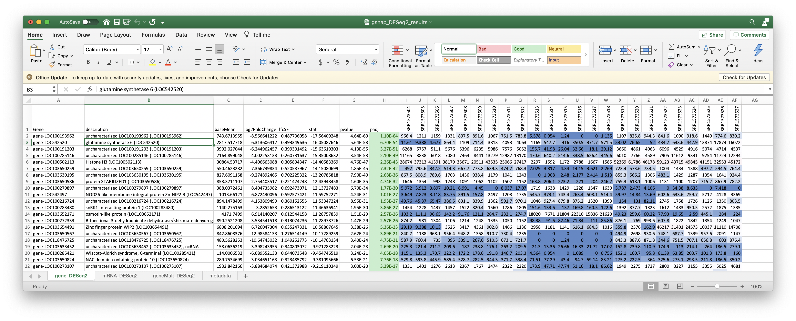

# 11 Map to Gene Names

Pull out `maize_rna.txt` from rna fasta file

```
gunzip -c GCF_902167145.1_Zm-B73-REFERENCE-NAM-5.0_rna.fna.gz |grep ">" > temp.txt

./reformat.pl temp.txt > maize_rna.txt

head -n5 maize_rna.txt 

NM_001111367.2	LOC541612	Ferredoxin-6, chloroplastic (LOC541612), mRNA; nuclear gene for chloroplast product
NM_001111369.2	LOC541614	squalene synthase 1 (LOC541614), mRNA
NM_001111370.3	LOC541615	sucrose transporter 1 (LOC541615), transcript variant 1, mRNA
NM_001111373.2	LOC541618	MAP kinase 2 (LOC541618), mRNA
NM_001111374.2	LOC541619	ferredoxin 2 (LOC541619), mRNA; nuclear gene for chloroplast product
```

<details><summary>reformat.pl</summary>

```
#! /usr/bin/env perl

use strict;
use warnings;

while(<>){
    chomp;
    if(/>(\S+)\s.+ mays (\S.+)\((\S+)\)(.+)/){
        print("$1\t$3\t$2($3)$4\n")
    }else{
        print("$_\n")
    }
}
```

</details>

Merge with Kallisto and Salmon results

```
library(tidyverse)
library(magrittr)

data <- readxl::read_excel("salmon_counts.xlsx", sheet = "NumReads")
names(data)

geneids <- read_delim("maize_rna.txt", delim="\t", col_names = c("id", "gene", "description"))
row.names(geneids) = geneids$id

sample_names <- names(data)[-1]
ids=data$Name

data$gene = geneids[ids,]$gene
data$description = geneids[ids,]$description

cdata<-data %>%
  select(Name, gene, description, all_of(sample_names))

write_delim(cdata, "salmon_NumReads.txt", delim="\t")
```

Merge with GSNAP results

```
library(tidyverse)
library(magrittr)

data <- readxl::read_excel("gsnap_DESeq2_results.xlsx", sheet = "geneMult_DESeq2")
names(data)

geneids <- read_delim("maize_gene.txt", delim="\t", col_names = c("gene", "description"))
row.names(geneids) = geneids$gene

sample_names <- names(data)[-1]
ids=gsub("gene-","",data$Gene)

#data$gene = geneids[ids,]$gene
data$description = geneids[ids,]$description

cdata<-data %>%
  select(Gene,description, all_of(sample_names))

write_delim(cdata, "geneMult_DESeq2.txt", delim="\t")
```




