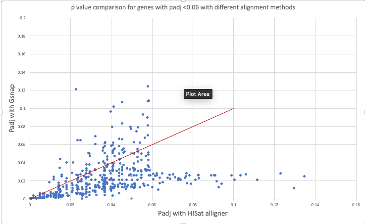

# Compare results

* Local machine
* May5th, 2021

I am going to compare the results of DGE, mostly comparing different alignment methods:

* It appears that people have used two different genomes for the analysis. So I need to compare them separately.

| genome | alignment method | person |
| :--| :--| :--|
| GCF_000188095.3_BIMP_2.2_genomic.fna Bumblebee.fasta | Hisat2| Rick |
| GCF_000188095.3_BIMP_2.2_genomic.fna Bumblebee.fasta |gsnap | Jennifer |

### NCBI genome
* GCF_000188095.3_BIMP_2.2_genomic.fna Bumblebee.fasta  

I am comparing Rick and Jennifer results :

#### Dealing with the NA values.
First I checked and both analysis has the same number of genes.

- If a gene is present in one but not the other result ( `#NA` while trying to combine the excel files) will change that to `-10`.

* I think `-10` is too big! I will be better off with a smaller number!

I plotted the difference between p values for each gene ( gsnap-hisat). any gene outside of the red triangle will not be reported with gsnap but not

