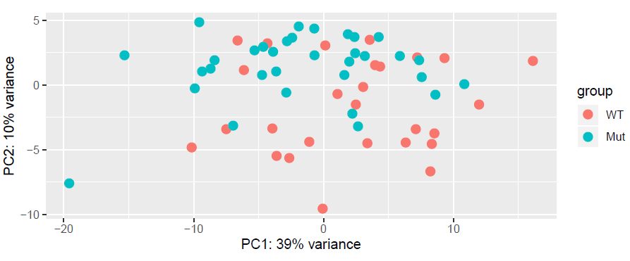

#  Differential expression anlysis on Bumblebee

### Softlink files
```
#/work/gif/TranscriptomicsWorkshop/remkv6/02_BumbleBee/02_Deseq_mRNA
for f in ../01_Align/*mRNA_counts_genes.txt; do ln -s $f;done
```

### Create the deseq table

This script creates those below.
```
ls -1 **mRNA_counts_genes.txt |while read line; do echo "<(awk '{print \"X\"\$7}' "$line")"; done |tr "\n" " " |sed 's/^/paste /g' |sed 's/$/ |less/g' |less
```

```
paste <(awk '{print $1,$7}' 1-A01-A1_S7_L002_R1_001.fastqmRNA_counts_genes.txt) <(awk '{print $7}' 1-A02-A2_S8_L002_R1_001.fastqmRNA_counts_genes.txt) <(awk '{print $7}' 1-A03-A3_S9_L002_R1_001.fastqmRNA_counts_genes.txt) <(awk '{print $7}' 1-A04-A4_S10_L002_R1_001.fastqmRNA_counts_genes.txt) <(awk '{print $7}' 1-A05-A5_S11_L002_R1_001.fastqmRNA_counts_genes.txt) <(awk '{print $7}' 1-A06-A6_S12_L002_R1_001.fastqmRNA_counts_genes.txt) <(awk '{print $7}' 1-A07-A7_S13_L002_R1_001.fastqmRNA_counts_genes.txt) <(awk '{print $7}' 1-A08-A8_S14_L002_R1_001.fastqmRNA_counts_genes.txt) <(awk '{print $7}' 1-A09-A9_S15_L002_R1_001.fastqmRNA_counts_genes.txt) <(awk '{print $7}' 1-A10-A10_S16_L002_R1_001.fastqmRNA_counts_genes.txt) <(awk '{print $7}' 1-A11-A11_S17_L002_R1_001.fastqmRNA_counts_genes.txt) <(awk '{print $7}' 1-A12-A12_S18_L002_R1_001.fastqmRNA_counts_genes.txt) <(awk '{print $7}' 1-B01-A13_S19_L002_R1_001.fastqmRNA_counts_genes.txt) <(awk '{print $7}' 1-B02-A14_S20_L002_R1_001.fastqmRNA_counts_genes.txt) <(awk '{print $7}' 1-B03-A16_S21_L002_R1_001-024.fastqmRNA_counts_genes.txt) <(awk '{print $7}' 1-B04-A17_S22_L002_R1_001.fastqmRNA_counts_genes.txt) <(awk '{print $7}' 1-B05-A18_S23_L002_R1_001.fastqmRNA_counts_genes.txt) <(awk '{print $7}' 1-B06-A19_S24_L002_R1_001.fastqmRNA_counts_genes.txt) <(awk '{print $7}' 1-B07-B2_S25_L002_R1_001.fastqmRNA_counts_genes.txt) <(awk '{print $7}' 1-B08-B3_S26_L002_R1_001.fastqmRNA_counts_genes.txt) <(awk '{print $7}' 1-B09-B4_S27_L002_R1_001.fastqmRNA_counts_genes.txt) <(awk '{print $7}' 1-B10-B5_S28_L002_R1_001.fastqmRNA_counts_genes.txt) <(awk '{print $7}' 1-B11-B6_S29_L002_R1_001.fastqmRNA_counts_genes.txt) <(awk '{print $7}' 1-B12-B7_S30_L002_R1_001.fastqmRNA_counts_genes.txt) <(awk '{print $7}' 1-C01-B8_S31_L002_R1_001.fastqmRNA_counts_genes.txt) <(awk '{print $7}' 1-C02-B10_S32_L002_R1_001.fastqmRNA_counts_genes.txt) <(awk '{print $7}' 1-C03-C1_S33_L002_R1_001.fastqmRNA_counts_genes.txt) <(awk '{print $7}' 1-C04-C2_S34_L002_R1_001.fastqmRNA_counts_genes.txt) <(awk '{print $7}' 1-C05-C3_S35_L002_R1_001.fastqmRNA_counts_genes.txt) <(awk '{print $7}' 1-C06-C4_S36_L002_R1_001.fastqmRNA_counts_genes.txt) <(awk '{print $7}' 1-C07-C6_S37_L002_R1_001.fastqmRNA_counts_genes.txt) <(awk '{print $7}' 1-C08-C7_S38_L002_R1_001.fastqmRNA_counts_genes.txt) <(awk '{print $7}' 1-C09-C8_S39_L002_R1_001.fastqmRNA_counts_genes.txt) <(awk '{print $7}' 1-C10-C9_S40_L002_R1_001.fastqmRNA_counts_genes.txt) <(awk '{print $7}' 1-C11-D1_S41_L002_R1_001.fastqmRNA_counts_genes.txt) <(awk '{print $7}' 1-C12-D2_S42_L002_R1_001.fastqmRNA_counts_genes.txt) <(awk '{print $7}' 1-D01-D5_S43_L002_R1_001.fastqmRNA_counts_genes.txt) <(awk '{print $7}' 1-D02-D6_S44_L002_R1_001.fastqmRNA_counts_genes.txt) <(awk '{print $7}' 1-D03-D7_S45_L002_R1_001.fastqmRNA_counts_genes.txt) <(awk '{print $7}' 1-D04-D8_S46_L002_R1_001.fastqmRNA_counts_genes.txt) <(awk '{print $7}' 1-D05-D9_S47_L002_R1_001.fastqmRNA_counts_genes.txt) <(awk '{print $7}' 1-D06-D10_S48_L002_R1_001.fastqmRNA_counts_genes.txt) <(awk '{print $7}' 1-D07-D11_S49_L002_R1_001.fastqmRNA_counts_genes.txt) <(awk '{print $7}' 1-D08-E1_S50_L002_R1_001.fastqmRNA_counts_genes.txt) <(awk '{print $7}' 1-D09-E2_S51_L002_R1_001.fastqmRNA_counts_genes.txt) <(awk '{print $7}' 1-D10-E5_S52_L002_R1_001.fastqmRNA_counts_genes.txt) <(awk '{print $7}' 1-D11-E7_S53_L002_R1_001.fastqmRNA_counts_genes.txt) <(awk '{print $7}' 1-D12-E8_S54_L002_R1_001.fastqmRNA_counts_genes.txt) <(awk '{print $7}' 1-E01-E9_S55_L002_R1_001.fastqmRNA_counts_genes.txt) <(awk '{print $7}' 1-E02-E10_S56_L002_R1_001.fastqmRNA_counts_genes.txt) <(awk '{print $7}' 1-E03-F1_S57_L002_R1_001.fastqmRNA_counts_genes.txt) <(awk '{print $7}' 1-E04-F2_S58_L002_R1_001.fastqmRNA_counts_genes.txt) <(awk '{print $7}' 1-E05-F3_S59_L002_R1_001.fastqmRNA_counts_genes.txt) <(awk '{print $7}' 1-E06-F4_S60_L002_R1_001.fastqmRNA_counts_genes.txt) <(awk '{print $7}' 1-E07-F5_S61_L002_R1_001.fastqmRNA_counts_genes.txt) <(awk '{print $7}' 1-E08-F6_S62_L002_R1_001.fastqmRNA_counts_genes.txt) <(awk '{print $7}' 1-E09-F7_S63_L002_R1_001.fastqmRNA_counts_genes.txt) <(awk '{print $7}' 1-E10-F8_S64_L002_R1_001.fastqmRNA_counts_genes.txt) <(awk '{print $7}' 1-E11-F9_S65_L002_R1_001.fastqmRNA_counts_genes.txt) <(awk '{print $7}' 1-E12-F10_S66_L002_R1_001.fastqmRNA_counts_genes.txt)  |less

```

Deseq table
```
paste <(awk '{print $1,$7}' 1-A01-A1_S7_L002_R1_001.fastqmRNA_counts_genes.txt) <(awk '{print $7}' 1-A02-A2_S8_L002_R1_001.fastqmRNA_counts_genes.txt) <(awk '{print $7}' 1-A03-A3_S9_L002_R1_001.fastqmRNA_counts_genes.txt) <(awk '{print $7}' 1-A04-A4_S10_L002_R1_001.fastqmRNA_counts_genes.txt) <(awk '{print $7}' 1-A05-A5_S11_L002_R1_001.fastqmRNA_counts_genes.txt) <(awk '{print $7}' 1-A06-A6_S12_L002_R1_001.fastqmRNA_counts_genes.txt) <(awk '{print $7}' 1-A07-A7_S13_L002_R1_001.fastqmRNA_counts_genes.txt) <(awk '{print $7}' 1-A08-A8_S14_L002_R1_001.fastqmRNA_counts_genes.txt) <(awk '{print $7}' 1-A09-A9_S15_L002_R1_001.fastqmRNA_counts_genes.txt) <(awk '{print $7}' 1-A10-A10_S16_L002_R1_001.fastqmRNA_counts_genes.txt) <(awk '{print $7}' 1-A11-A11_S17_L002_R1_001.fastqmRNA_counts_genes.txt) <(awk '{print $7}' 1-A12-A12_S18_L002_R1_001.fastqmRNA_counts_genes.txt) <(awk '{print $7}' 1-B01-A13_S19_L002_R1_001.fastqmRNA_counts_genes.txt) <(awk '{print $7}' 1-B02-A14_S20_L002_R1_001.fastqmRNA_counts_genes.txt) <(awk '{print $7}' 1-B03-A16_S21_L002_R1_001-024.fastqmRNA_counts_genes.txt) <(awk '{print $7}' 1-B04-A17_S22_L002_R1_001.fastqmRNA_counts_genes.txt) <(awk '{print $7}' 1-B05-A18_S23_L002_R1_001.fastqmRNA_counts_genes.txt) <(awk '{print $7}' 1-B06-A19_S24_L002_R1_001.fastqmRNA_counts_genes.txt) <(awk '{print $7}' 1-B07-B2_S25_L002_R1_001.fastqmRNA_counts_genes.txt) <(awk '{print $7}' 1-B08-B3_S26_L002_R1_001.fastqmRNA_counts_genes.txt) <(awk '{print $7}' 1-B09-B4_S27_L002_R1_001.fastqmRNA_counts_genes.txt) <(awk '{print $7}' 1-B10-B5_S28_L002_R1_001.fastqmRNA_counts_genes.txt) <(awk '{print $7}' 1-B11-B6_S29_L002_R1_001.fastqmRNA_counts_genes.txt) <(awk '{print $7}' 1-B12-B7_S30_L002_R1_001.fastqmRNA_counts_genes.txt) <(awk '{print $7}' 1-C01-B8_S31_L002_R1_001.fastqmRNA_counts_genes.txt) <(awk '{print $7}' 1-C02-B10_S32_L002_R1_001.fastqmRNA_counts_genes.txt) <(awk '{print $7}' 1-C03-C1_S33_L002_R1_001.fastqmRNA_counts_genes.txt) <(awk '{print $7}' 1-C04-C2_S34_L002_R1_001.fastqmRNA_counts_genes.txt) <(awk '{print $7}' 1-C05-C3_S35_L002_R1_001.fastqmRNA_counts_genes.txt) <(awk '{print $7}' 1-C06-C4_S36_L002_R1_001.fastqmRNA_counts_genes.txt) <(awk '{print $7}' 1-C07-C6_S37_L002_R1_001.fastqmRNA_counts_genes.txt) <(awk '{print $7}' 1-C08-C7_S38_L002_R1_001.fastqmRNA_counts_genes.txt) <(awk '{print $7}' 1-C09-C8_S39_L002_R1_001.fastqmRNA_counts_genes.txt) <(awk '{print $7}' 1-C10-C9_S40_L002_R1_001.fastqmRNA_counts_genes.txt) <(awk '{print $7}' 1-C11-D1_S41_L002_R1_001.fastqmRNA_counts_genes.txt) <(awk '{print $7}' 1-C12-D2_S42_L002_R1_001.fastqmRNA_counts_genes.txt) <(awk '{print $7}' 1-D01-D5_S43_L002_R1_001.fastqmRNA_counts_genes.txt) <(awk '{print $7}' 1-D02-D6_S44_L002_R1_001.fastqmRNA_counts_genes.txt) <(awk '{print $7}' 1-D03-D7_S45_L002_R1_001.fastqmRNA_counts_genes.txt) <(awk '{print $7}' 1-D04-D8_S46_L002_R1_001.fastqmRNA_counts_genes.txt) <(awk '{print $7}' 1-D05-D9_S47_L002_R1_001.fastqmRNA_counts_genes.txt) <(awk '{print $7}' 1-D06-D10_S48_L002_R1_001.fastqmRNA_counts_genes.txt) <(awk '{print $7}' 1-D07-D11_S49_L002_R1_001.fastqmRNA_counts_genes.txt) <(awk '{print $7}' 1-D08-E1_S50_L002_R1_001.fastqmRNA_counts_genes.txt) <(awk '{print $7}' 1-D09-E2_S51_L002_R1_001.fastqmRNA_counts_genes.txt) <(awk '{print $7}' 1-D10-E5_S52_L002_R1_001.fastqmRNA_counts_genes.txt) <(awk '{print $7}' 1-D11-E7_S53_L002_R1_001.fastqmRNA_counts_genes.txt) <(awk '{print $7}' 1-D12-E8_S54_L002_R1_001.fastqmRNA_counts_genes.txt) <(awk '{print $7}' 1-E01-E9_S55_L002_R1_001.fastqmRNA_counts_genes.txt) <(awk '{print $7}' 1-E02-E10_S56_L002_R1_001.fastqmRNA_counts_genes.txt) <(awk '{print $7}' 1-E03-F1_S57_L002_R1_001.fastqmRNA_counts_genes.txt) <(awk '{print $7}' 1-E04-F2_S58_L002_R1_001.fastqmRNA_counts_genes.txt) <(awk '{print $7}' 1-E05-F3_S59_L002_R1_001.fastqmRNA_counts_genes.txt) <(awk '{print $7}' 1-E06-F4_S60_L002_R1_001.fastqmRNA_counts_genes.txt) <(awk '{print $7}' 1-E07-F5_S61_L002_R1_001.fastqmRNA_counts_genes.txt) <(awk '{print $7}' 1-E08-F6_S62_L002_R1_001.fastqmRNA_counts_genes.txt) <(awk '{print $7}' 1-E09-F7_S63_L002_R1_001.fastqmRNA_counts_genes.txt) <(awk '{print $7}' 1-E10-F8_S64_L002_R1_001.fastqmRNA_counts_genes.txt) <(awk '{print $7}' 1-E11-F9_S65_L002_R1_001.fastqmRNA_counts_genes.txt) <(awk '{print $7}' 1-E12-F10_S66_L002_R1_001.fastqmRNA_counts_genes.txt)  |awk 'NR>2' |sed 's/_L002_R1_001.fastqGene_sorted.bam//g' |awk '{print $1,$2,$3,$4,$5,$6,$7,$8,$9,$10,$11,$12,$13,$14,$15,$16,$17,$18,$19,$28,$29,$30,$31,$32,$33,$34,$35,$20,$21,$22,$23,$24,$25,$26,$27,$36,$37,$38,$39,$40,$41,$42,$43,$44,$45,$46,$47,$48,$49,$50,$51,$52,$53,$54,$55,$56,$57,$58,$59,$60,$61}' |sed 's/ /\t/g' >tailer.txt

paste <(awk '{print $1,"X"$7}' 1-A01-A1_S7_L002_R1_001.fastqmRNA_counts_genes.txt) <(awk '{print "X"$7}' 1-A02-A2_S8_L002_R1_001.fastqmRNA_counts_genes.txt) <(awk '{print "X"$7}' 1-A03-A3_S9_L002_R1_001.fastqmRNA_counts_genes.txt) <(awk '{print "X"$7}' 1-A04-A4_S10_L002_R1_001.fastqmRNA_counts_genes.txt) <(awk '{print "X"$7}' 1-A05-A5_S11_L002_R1_001.fastqmRNA_counts_genes.txt) <(awk '{print "X"$7}' 1-A06-A6_S12_L002_R1_001.fastqmRNA_counts_genes.txt) <(awk '{print "X"$7}' 1-A07-A7_S13_L002_R1_001.fastqmRNA_counts_genes.txt) <(awk '{print "X"$7}' 1-A08-A8_S14_L002_R1_001.fastqmRNA_counts_genes.txt) <(awk '{print "X"$7}' 1-A09-A9_S15_L002_R1_001.fastqmRNA_counts_genes.txt) <(awk '{print "X"$7}' 1-A10-A10_S16_L002_R1_001.fastqmRNA_counts_genes.txt) <(awk '{print "X"$7}' 1-A11-A11_S17_L002_R1_001.fastqmRNA_counts_genes.txt) <(awk '{print "X"$7}' 1-A12-A12_S18_L002_R1_001.fastqmRNA_counts_genes.txt) <(awk '{print "X"$7}' 1-B01-A13_S19_L002_R1_001.fastqmRNA_counts_genes.txt) <(awk '{print "X"$7}' 1-B02-A14_S20_L002_R1_001.fastqmRNA_counts_genes.txt) <(awk '{print "X"$7}' 1-B03-A16_S21_L002_R1_001-024.fastqmRNA_counts_genes.txt) <(awk '{print "X"$7}' 1-B04-A17_S22_L002_R1_001.fastqmRNA_counts_genes.txt) <(awk '{print "X"$7}' 1-B05-A18_S23_L002_R1_001.fastqmRNA_counts_genes.txt) <(awk '{print "X"$7}' 1-B06-A19_S24_L002_R1_001.fastqmRNA_counts_genes.txt) <(awk '{print "X"$7}' 1-B07-B2_S25_L002_R1_001.fastqmRNA_counts_genes.txt) <(awk '{print "X"$7}' 1-B08-B3_S26_L002_R1_001.fastqmRNA_counts_genes.txt) <(awk '{print "X"$7}' 1-B09-B4_S27_L002_R1_001.fastqmRNA_counts_genes.txt) <(awk '{print "X"$7}' 1-B10-B5_S28_L002_R1_001.fastqmRNA_counts_genes.txt) <(awk '{print "X"$7}' 1-B11-B6_S29_L002_R1_001.fastqmRNA_counts_genes.txt) <(awk '{print "X"$7}' 1-B12-B7_S30_L002_R1_001.fastqmRNA_counts_genes.txt) <(awk '{print "X"$7}' 1-C01-B8_S31_L002_R1_001.fastqmRNA_counts_genes.txt) <(awk '{print "X"$7}' 1-C02-B10_S32_L002_R1_001.fastqmRNA_counts_genes.txt) <(awk '{print "X"$7}' 1-C03-C1_S33_L002_R1_001.fastqmRNA_counts_genes.txt) <(awk '{print "X"$7}' 1-C04-C2_S34_L002_R1_001.fastqmRNA_counts_genes.txt) <(awk '{print "X"$7}' 1-C05-C3_S35_L002_R1_001.fastqmRNA_counts_genes.txt) <(awk '{print "X"$7}' 1-C06-C4_S36_L002_R1_001.fastqmRNA_counts_genes.txt) <(awk '{print "X"$7}' 1-C07-C6_S37_L002_R1_001.fastqmRNA_counts_genes.txt) <(awk '{print "X"$7}' 1-C08-C7_S38_L002_R1_001.fastqmRNA_counts_genes.txt) <(awk '{print "X"$7}' 1-C09-C8_S39_L002_R1_001.fastqmRNA_counts_genes.txt) <(awk '{print "X"$7}' 1-C10-C9_S40_L002_R1_001.fastqmRNA_counts_genes.txt) <(awk '{print "X"$7}' 1-C11-D1_S41_L002_R1_001.fastqmRNA_counts_genes.txt) <(awk '{print "X"$7}' 1-C12-D2_S42_L002_R1_001.fastqmRNA_counts_genes.txt) <(awk '{print "X"$7}' 1-D01-D5_S43_L002_R1_001.fastqmRNA_counts_genes.txt) <(awk '{print "X"$7}' 1-D02-D6_S44_L002_R1_001.fastqmRNA_counts_genes.txt) <(awk '{print "X"$7}' 1-D03-D7_S45_L002_R1_001.fastqmRNA_counts_genes.txt) <(awk '{print "X"$7}' 1-D04-D8_S46_L002_R1_001.fastqmRNA_counts_genes.txt) <(awk '{print "X"$7}' 1-D05-D9_S47_L002_R1_001.fastqmRNA_counts_genes.txt) <(awk '{print "X"$7}' 1-D06-D10_S48_L002_R1_001.fastqmRNA_counts_genes.txt) <(awk '{print "X"$7}' 1-D07-D11_S49_L002_R1_001.fastqmRNA_counts_genes.txt) <(awk '{print "X"$7}' 1-D08-E1_S50_L002_R1_001.fastqmRNA_counts_genes.txt) <(awk '{print "X"$7}' 1-D09-E2_S51_L002_R1_001.fastqmRNA_counts_genes.txt) <(awk '{print "X"$7}' 1-D10-E5_S52_L002_R1_001.fastqmRNA_counts_genes.txt) <(awk '{print "X"$7}' 1-D11-E7_S53_L002_R1_001.fastqmRNA_counts_genes.txt) <(awk '{print "X"$7}' 1-D12-E8_S54_L002_R1_001.fastqmRNA_counts_genes.txt) <(awk '{print "X"$7}' 1-E01-E9_S55_L002_R1_001.fastqmRNA_counts_genes.txt) <(awk '{print "X"$7}' 1-E02-E10_S56_L002_R1_001.fastqmRNA_counts_genes.txt) <(awk '{print "X"$7}' 1-E03-F1_S57_L002_R1_001.fastqmRNA_counts_genes.txt) <(awk '{print "X"$7}' 1-E04-F2_S58_L002_R1_001.fastqmRNA_counts_genes.txt) <(awk '{print "X"$7}' 1-E05-F3_S59_L002_R1_001.fastqmRNA_counts_genes.txt) <(awk '{print "X"$7}' 1-E06-F4_S60_L002_R1_001.fastqmRNA_counts_genes.txt) <(awk '{print "X"$7}' 1-E07-F5_S61_L002_R1_001.fastqmRNA_counts_genes.txt) <(awk '{print "X"$7}' 1-E08-F6_S62_L002_R1_001.fastqmRNA_counts_genes.txt) <(awk '{print "X"$7}' 1-E09-F7_S63_L002_R1_001.fastqmRNA_counts_genes.txt) <(awk '{print "X"$7}' 1-E10-F8_S64_L002_R1_001.fastqmRNA_counts_genes.txt) <(awk '{print "X"$7}' 1-E11-F9_S65_L002_R1_001.fastqmRNA_counts_genes.txt) <(awk '{print "X"$7}' 1-E12-F10_S66_L002_R1_001.fastqmRNA_counts_genes.txt)   |awk 'NR==2' |sed 's/_L002_R1_001.fastqGene_sorted.bam//g' |awk '{print $1,$2,$3,$4,$5,$6,$7,$8,$9,$10,$11,$12,$13,$14,$15,$16,$17,$18,$19,$28,$29,$30,$31,$32,$33,$34,$35,$20,$21,$22,$23,$24,$25,$26,$27,$36,$37,$38,$39,$40,$41,$42,$43,$44,$45,$46,$47,$48,$49,$50,$51,$52,$53,$54,$55,$56,$57,$58,$59,$60,$61}' |sed 's/ /\t/g' |sed 's/_L002_R1_001-024.fastqGene_sorted.bam//g' >header.txt  
```

Compile deseq and condition table.
```
cat header.txt tailer.txt >DeseqTable.txt
tr "\t" "\n" <header.txt |awk '{if(NR==1){print $0} else if(NR<28) {print $0"\t0"} else {print $0"\t1"}}'>ConditionTable.txt
```

### Run Deseq2
```
ml gcc/7.3.0-xegsmw4 r-deseq2/1.24.0-py3-jiqp45b

 library("DESeq2")
 dat<-read.table("DeseqTable.txt",header = T,quote = "",row.names = 1)
 dat <- as.matrix(dat)
 condition <- factor(c(rep("WT",27),rep("Mut",33)))
 condition=relevel(condition,ref = "WT")
 coldata <-read.table("ConditionTable.txt",header = T,row.names = 1)
 coldata <- data.frame(row.names=colnames(dat), condition)
 dds <- DESeqDataSetFromMatrix(countData = dat, colData = coldata,design=~ condition)
 dds <- DESeq(dds)
 res <- results(dds)
 table(res$padj<0.05)
 res <- res[order(res$padj), ]
 resdata <- merge(as.data.frame(res), as.data.frame(counts(dds, normalized=TRUE)), by="row.names", sort=FALSE)
 names(resdata)[1] <- "Gene"
 write.csv(resdata, file="AllExposedvsAllControl.csv",quote = FALSE,row.names = F)

 estimating size factors
 estimating dispersions
 gene-wise dispersion estimates
 mean-dispersion relationship
 final dispersion estimates
 fitting model and testing
 -- replacing outliers and refitting for 28 genes
 -- DESeq argument 'minReplicatesForReplace' = 7
 -- original counts are preserved in counts(dds)
 estimating dispersions
 fitting model and testing
 >  res <- results(dds)
 >  table(res$padj<0.05)

 FALSE  TRUE
  4509   250

rld <- rlogTransformation(dds)
library(ggplot2)
p <- plotPCA(rld)
p <- p + geom_text(aes_string(x = "PC1", y = "PC2", label = ""), color = "black")
print(p)
q()

```

