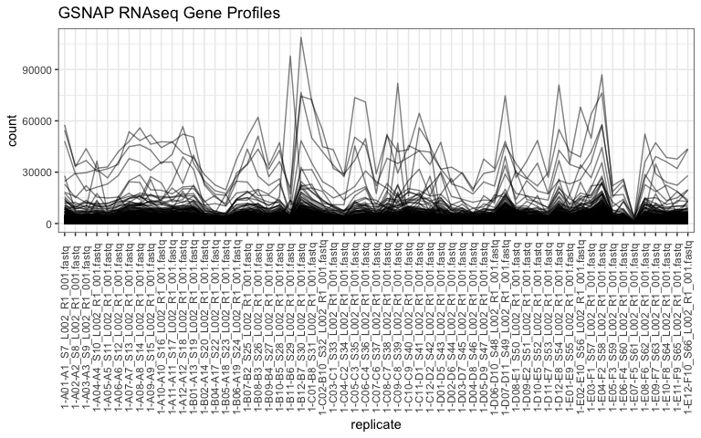
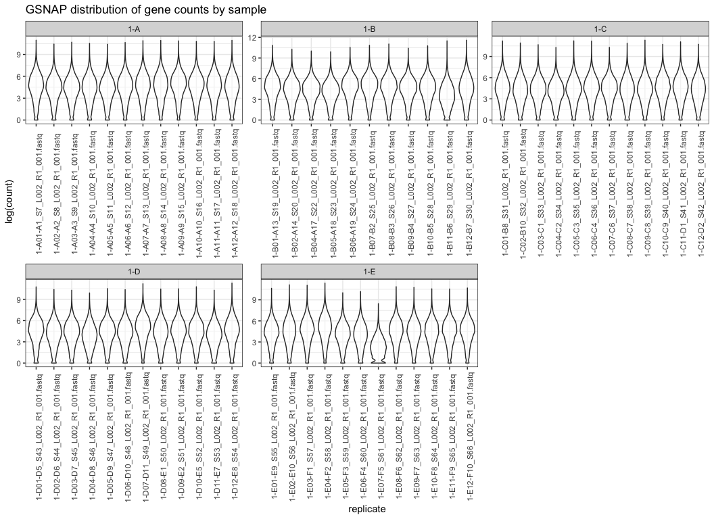

R Analysis
================
Jennifer Chang
1/8/2021

## R Markdown

This is a placeholder to store any analysis in R (edgeR, DESeq2). Also a
way to look at the underlying assumptions (RNASeq distribution functions
and how it behaves in an analysis pipeline. Is the distribution
realistic?)

## Install any required libraries

``` r
# == Install any CRAN packages
# cran_pkgs <- c("QuasiSeq")
# install.packages(cran_pkgs)

# == Install any Bioconductor packages
# bioc_pkgs <- c("edgeR", "baySeq", "DESeq2", "ballgown", "NOISeq", "limma")
# BiocManager::install(bioc_pkgs)

# ====================   Year of development
library(tidyverse)
library(magrittr)
#library(edgeR)         # 2010
#library(baySeq)        # 2010
#library(QuasiSeq)      # 2012
library(DESeq2)        # 2014    # <= actually a bit strange that DESeq2 & edgeR tend to be equivalent, despite being 4yrs later
#library(ballgown)      # 2014
#library(NOISeq)        # 2015
#library(limma)         # 2015
```

# Load in RNAseq counts

Load in the RNAseq counts generated by GSNAP.

``` r
#data_maize <- read_delim("maize_genecounts.txt", delim = "\t")
data_bee <- read_delim("~/Desktop/bee/bee.genecounts.out.txt", delim="\t")
#> Parsed with column specification:
#> cols(
#>   .default = col_double(),
#>   Geneid = col_character()
#> )
#> See spec(...) for full column specifications.
```

# Diagnostic plots

These are quick plots to look at the data and notice if any of the
counts seem unusally high or low, or multimodal. It can indicate a
problem with a sample, but does not necessarily mean there is a problem
with a sample.

## Bee

``` r
melt_bee <- data_bee %>%
  pivot_longer(!Geneid, names_to = "replicate", values_to = "count")  %>%
  mutate(
    group=substr(replicate, 1, 3)                 # <= replace this with metadata information later (A1-A19, B1-B*)
  )

melt_bee %>% 
  ggplot(., aes(x=replicate, y=count, group=Geneid)) + 
  geom_line(alpha=0.5) +
  theme_bw() +
  theme(
    axis.text.x = element_text(angle=90, vjust=0.5)
  ) +
  labs(title="GSNAP RNAseq Gene Profiles") #try boxplot with group?
```

<!-- -->

Distribution, violin plot

``` r
melt_bee %>% 
  ggplot(., aes(x=replicate,y=log(count))) +       # <= log transformed as a rough normalization... we will use DESeq2's normalization eventually
  geom_violin(alpha=0.5) +
  theme_bw() +
  theme(
    axis.text.x = element_text(angle=90)
  ) +
  labs(title="GSNAP distribution of gene counts by sample") +
  facet_wrap(~group, scales="free", drop=T)
#> Warning: Removed 208583 rows containing non-finite values (stat_ydensity).
```

<!-- -->

Check if any of the replicates seem obviously different from the others.
Mostly seems fine, `1-E07-F3-S59 distribution` is a little low compared
to others, `1-B03-A16_S21` seems a little high compared to others.

## Maize

``` r
melt_maize <- data_maize %>%
  pivot_longer(!Geneid, names_to = "replicate", values_to = "count")

melt_maize %>% 
  ggplot(., aes(x=replicate, y=count, group=Geneid)) + 
  geom_line(alpha=0.5) +
  theme_bw() +
  theme(
    axis.text.x = element_text(angle=90, vjust=0.5)
  ) +
  labs(title="GSNAP RNAseq Gene Profiles")
```

``` r
melt_maize %>% 
  ggplot(., aes(x=replicate,y=log(count))) +       # <= log transformed as a rough normalization... we will use DESeq2's normalization eventually
  geom_violin(alpha=0.5) +
  theme_bw() +
  theme(
    axis.text.x = element_text(angle=90)
  ) +
  labs(title="GSNAP distribution of gene counts by sample")
#  facet_wrap(~group, scales="free", drop=T)
```

Check if any of the replicates seem obviously different from the others.
Mostly seems okay, `SRR1573509` and `SRR1573523` is a little low
compared to others, `SRR1573513` seems a little high compared to others.

## DESEQ2

Most of these commands I got from Siva, working on the WGCNA tutorial
and other notes from Siva.

``` r
# library(DESeq2)

de_input = as.matrix(data_bee[-1])
row.names(de_input) = data_bee$Geneid
de_input[1:5,1:6]

metadata <- readr::read_delim("../bumblebee_meta.csv", delim=",")
row.names(metadata) = metadata$Well_ID

meta_df <- data.frame( Sample = colnames(de_input)) %>%
  separate(Sample, 
           c(NA, "group", NA, NA), 
           sep="-", 
           remove=FALSE) %>%
  mutate(
    Condition = metadata[group,]$Trt,
    Condition = factor(Condition, levels=c("ctrl", "exposed"))
  )
```

Start DESeq2, modified from Masonbrink’s notes.

``` r
dds <- DESeqDataSetFromMatrix(
  de_input,                # Gene counts
  colData = meta_df,       # Metadata
  design = ~Condition      # experimental design
)
dds <- DESeq(dds)
res <- results(dds)
table(res$padj<0.05)
res <- res[order(res$padj), ]
resdata <- merge(as.data.frame(res), as.data.frame(counts(dds, normalized=TRUE)), by="row.names", sort=FALSE)
names(resdata)[1] <- "Gene"
write.csv(resdata, file="AllExposedvsAllControlGene.csv",quote = FALSE,row.names = F)

rld <- rlogTransformation(dds)
summary(rld)

(p <- plotPCA(rld, intgroup="Condition") +
    theme_bw() +
    labs(x = "PC1", y="PC2")
)
```

## Other diagnostic plots

Rough outline

``` r
ordered_trt = c(meta_df %>% subset(Condition=="ctrl") %>% {.$Sample},
                meta_df %>% subset(Condition=="exposed") %>% {.$Sample})

DEgenes <- resdata %>%
  subset(padj < 0.05) %>%
  select(-c(2:7)) %>%
  pivot_longer(col=-1, names_to="treatment", values_to="expression") %>% 
  separate(treatment, 
           c(NA, "group", NA, NA), 
           sep="-", 
           remove=FALSE) %>%
  mutate(
    Condition = metadata[group,]$Trt,
    Condition = factor(Condition, levels=c("ctrl", "exposed")),
    treatment = factor(treatment, levels=ordered_trt)
  )

# Very rough draft, fix this later...
DEgenes %>% ggplot(., aes(x=treatment, y=expression, group=Gene)) +
  geom_line(alpha=0.5) +
  geom_point(aes(color=Condition), size=0.5) +
  theme_bw() + 
  theme(
    axis.text.x = element_text(angle=90)
  )# +
#  facet_wrap(~Condition, scales="free_x", drop=T)
```

Hmm… plot the top 20 differentially expressed genes (lowest padj
values)… rough draft, go back and check on normalization and metadata…

``` r
top20 = resdata[c(1:20),] %>%
  subset(padj < 0.05) %>%
  select(-c(2:7)) %>%
  pivot_longer(col=-1, names_to="treatment", values_to="expression") %>% 
  separate(treatment, 
           c(NA, "group", NA, NA), 
           sep="-", 
           remove=FALSE) %>%
  mutate(
    Condition = metadata[group,]$Trt,
    Condition = factor(Condition, levels=c("ctrl", "exposed")),
    treatment = factor(treatment, levels=ordered_trt)
  )

top20 %>% ggplot(., aes(x = as.factor(Gene), y = expression, fill=Condition))+
  geom_boxplot() + 
  theme_bw() +
  theme(
    axis.text.x = element_text(angle=45, hjust = 1)
  ) +
  labs(x="Gene")
```
